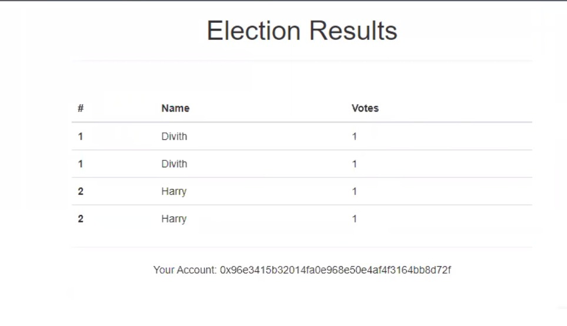

# Decentralised Voting System

### Introduction

In traditional voting applications which are based on a centralized approach, there is a
general convention that the applications are usually provided by a centralized database
handled by an administrator. When voting via a centralized application one big concern
is security. The results may be tampered with or there could be attacks on the system to
modify the results to a desired outcome. Another issue with centralized systems is that
each server typically provides only a single function thereby making it a single point of
failure. This means that in the event of an attack on a specific node, the entire system
will fail.
To overcome these obstacles, we use a decentralized voting application. It is based on
two principles- a peer to peer network is incorporated with the application logic and
executed independently on every server. Here, a central node doesn’t co-ordinate the
servers. The servers communicate with each other directly. The second principle is
called blockchain guarantees. This implies that the data cannot be modified in a
retroactive manner. A decentralized voting application can make security breaches futile
by replicating the execution over a network which includes several servers.
A blockchain database is used which is based on a chain of blocks where a block is a
record holding a set of digitally signed transactions, some metadata and a link to the
previous block. A blockchain database addresses security concerns by protecting against
attacks from malicious parties.

### Dependencies

Node Package Manager (NPM)- This is the first dependency needed which comes with Node.js.

Truffle- A framework that allows us to create centralized applications on the Ethereum network. Gives us a suite of tools that allow us to write smart contracts on Solidity. It allows provides a framework for testing our smart contracts and deploying them on the blockchain. We will be using the Pet Shop Box here, which includes the basic project
structure along with the code.

Ganache- A local end-memory blockchain. Starts running a local blockchain on the machine. In the project, it starts with ten accounts. Each account represents the voters in the election and have a unique address. The accounts have been credited with 100.00 ETH.

### Running the project

### Compiling Contracts

    truffle migrate -reset

### Start Server

    npm run dev

Once the server starts, we are redirected to the website.

### Demonstration

